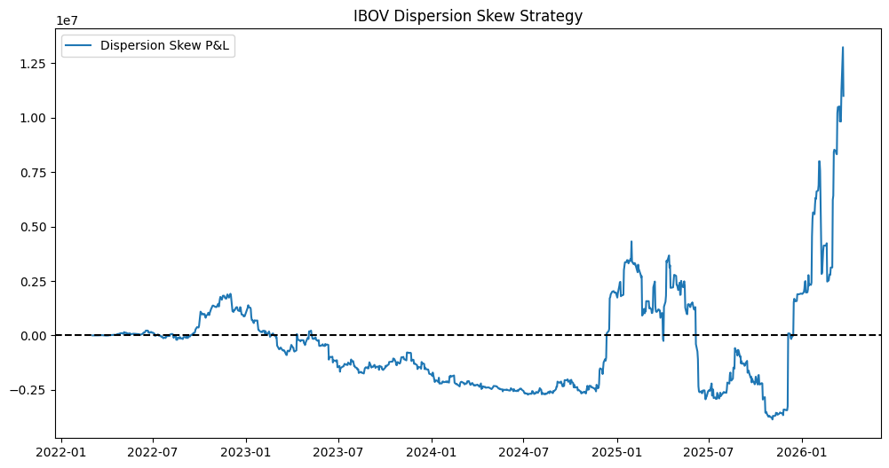

## This project implements a reproducible dispersion‑skew backtest, through a React frontend: it builds index and single‑stock option legs using a Black–Scholes pricing proxy and an implied‑vol mapping derived from realized volatility, then computes daily and cumulative P&L. Below is the backtest routine that the Flask API calls.

### 1. Import Packages


```python
import numpy as np
import pandas as pd
import yfinance as yf
import matplotlib.pyplot as plt

from scipy.stats import norm
```

### 2. Functions Definition


```python
def black_scholes(forward, strike, time_to_expiry, volatility, option_type="call"):
    """Simple European Black‑Scholes (no discounting)."""
    if time_to_expiry <= 0:
        if option_type.lower().startswith("c"):
            return max(forward - strike, 0.0)
        return max(strike - forward, 0.0)
    vol_sqrt_t = volatility * np.sqrt(time_to_expiry)
    d1 = (np.log(forward / strike) + 0.5 * volatility**2 * time_to_expiry) / vol_sqrt_t
    d2 = d1 - vol_sqrt_t
    if option_type.lower().startswith("c"):
        return norm.cdf(d1) * forward - norm.cdf(d2) * strike
    else:
        return norm.cdf(-d2) * strike - norm.cdf(-d1) * forward

def implied_vol_proxy(rv, base=0.20, skew_slope=-0.25):
    """
    rv: realized vol
    base: long-term IV anchor
    skew_slope: controls downside skew
    """
    return base + 0.5 * rv

def strike_from_delta(S, T, sigma, delta=0.25, call=True):
    sign = 1 if call else -1
    d1 = sign * norm.ppf(delta)
    return S * np.exp(
        -sigma * np.sqrt(T) * d1 + 0.5 * sigma**2 * T
    )

def option_vega(S, K, T, sigma):
    d1 = (np.log(S / K) + 0.5 * sigma**2 * T) / (sigma * np.sqrt(T))
    return S * norm.pdf(d1) * np.sqrt(T)

# P&L engine
def option_pnl_series(S, K, T, sigma_series, vega_notional):
    prices = []
    
    for sigma in sigma_series:
        price = black_scholes(
            forward=S,
            strike=K,
            time_to_expiry=T,
            volatility=sigma,
            option_type="call"
        )
        prices.append(price)
    
    prices = pd.Series(prices, index=sigma_series.index)
    pnl = prices.diff().fillna(0)

    vega = option_vega(S, K, T, sigma_series.iloc[0])
    scale = vega_notional / vega

    return pnl * scale
```

### 3. Universe Definition


```python
# Index + top 10 IBOV names (example tickers)
INDEX = "^BVSP"

SINGLES = [
    "PETR4.SA", "VALE3.SA", "ITUB4.SA", "BBDC4.SA", "ABEV3.SA",
    "BBAS3.SA", "WEGE3.SA", "RENT3.SA", "SUZB3.SA", "JBSS3.SA"
]
```

### 4. Obtain Price Data


```python
tickers = [INDEX] + SINGLES

prices = yf.download(
    tickers,
    start="2022-01-01",
    auto_adjust=True
)["Close"]

prices = prices.dropna(axis=1, how="any")

returns = np.log(prices / prices.shift(1))
returns
```


<div>
<style scoped>
    .dataframe tbody tr th:only-of-type {
        vertical-align: middle;
    }

    .dataframe tbody tr th {
        vertical-align: top;
    }

    .dataframe thead th {
        text-align: right;
    }
</style>
<table border="1" class="dataframe">
  <thead>
    <tr style="text-align: right;">
      <th>Ticker</th>
      <th>ABEV3.SA</th>
      <th>BBAS3.SA</th>
      <th>BBDC4.SA</th>
      <th>ITUB4.SA</th>
      <th>PETR4.SA</th>
      <th>RENT3.SA</th>
      <th>SUZB3.SA</th>
      <th>VALE3.SA</th>
      <th>WEGE3.SA</th>
      <th>^BVSP</th>
    </tr>
    <tr>
      <th>Date</th>
      <th></th>
      <th></th>
      <th></th>
      <th></th>
      <th></th>
      <th></th>
      <th></th>
      <th></th>
      <th></th>
      <th></th>
    </tr>
  </thead>
  <tbody>
    <tr>
      <th>2022-01-03</th>
      <td>NaN</td>
      <td>NaN</td>
      <td>NaN</td>
      <td>NaN</td>
      <td>NaN</td>
      <td>NaN</td>
      <td>NaN</td>
      <td>NaN</td>
      <td>NaN</td>
      <td>NaN</td>
    </tr>
    <tr>
      <th>2022-01-04</th>
      <td>-0.001305</td>
      <td>0.001040</td>
      <td>0.006535</td>
      <td>0.027964</td>
      <td>0.003774</td>
      <td>0.005682</td>
      <td>0.021581</td>
      <td>-0.011865</td>
      <td>-0.005009</td>
      <td>-0.003934</td>
    </tr>
    <tr>
      <th>2022-01-05</th>
      <td>-0.019790</td>
      <td>-0.016778</td>
      <td>-0.007095</td>
      <td>-0.019170</td>
      <td>-0.039467</td>
      <td>-0.029344</td>
      <td>-0.011397</td>
      <td>0.009426</td>
      <td>-0.054172</td>
      <td>-0.024527</td>
    </tr>
    <tr>
      <th>2022-01-06</th>
      <td>-0.016119</td>
      <td>0.008074</td>
      <td>0.014142</td>
      <td>0.020073</td>
      <td>-0.000713</td>
      <td>0.003816</td>
      <td>-0.008005</td>
      <td>0.019977</td>
      <td>-0.000331</td>
      <td>0.005480</td>
    </tr>
    <tr>
      <th>2022-01-07</th>
      <td>-0.016383</td>
      <td>0.001048</td>
      <td>0.014439</td>
      <td>0.021891</td>
      <td>0.004624</td>
      <td>-0.008454</td>
      <td>-0.006720</td>
      <td>0.056571</td>
      <td>-0.025513</td>
      <td>0.011338</td>
    </tr>
    <tr>
      <th>...</th>
      <td>...</td>
      <td>...</td>
      <td>...</td>
      <td>...</td>
      <td>...</td>
      <td>...</td>
      <td>...</td>
      <td>...</td>
      <td>...</td>
      <td>...</td>
    </tr>
    <tr>
      <th>2026-03-18</th>
      <td>-0.018818</td>
      <td>-0.011045</td>
      <td>-0.011740</td>
      <td>-0.010119</td>
      <td>0.013279</td>
      <td>-0.011496</td>
      <td>-0.010410</td>
      <td>-0.023449</td>
      <td>-0.000866</td>
      <td>-0.004277</td>
    </tr>
    <tr>
      <th>2026-03-19</th>
      <td>0.002033</td>
      <td>0.004263</td>
      <td>0.000537</td>
      <td>0.007071</td>
      <td>-0.004692</td>
      <td>0.007003</td>
      <td>-0.027780</td>
      <td>-0.006504</td>
      <td>0.009272</td>
      <td>0.003506</td>
    </tr>
    <tr>
      <th>2026-03-20</th>
      <td>-0.020521</td>
      <td>-0.010261</td>
      <td>-0.016771</td>
      <td>-0.016260</td>
      <td>-0.024014</td>
      <td>-0.027618</td>
      <td>-0.018559</td>
      <td>-0.014194</td>
      <td>-0.013614</td>
      <td>-0.022734</td>
    </tr>
    <tr>
      <th>2026-03-23</th>
      <td>0.013045</td>
      <td>0.029221</td>
      <td>0.035900</td>
      <td>0.029173</td>
      <td>0.007852</td>
      <td>0.084926</td>
      <td>0.028293</td>
      <td>0.025354</td>
      <td>0.029862</td>
      <td>0.031905</td>
    </tr>
    <tr>
      <th>2026-03-24</th>
      <td>0.002725</td>
      <td>-0.013023</td>
      <td>-0.003163</td>
      <td>-0.005626</td>
      <td>0.026583</td>
      <td>-0.012837</td>
      <td>-0.008756</td>
      <td>0.007841</td>
      <td>0.004224</td>
      <td>0.003167</td>
    </tr>
  </tbody>
</table>
<p>1055 rows × 10 columns</p>
</div>


### 5. Set RV Window


```python
RV_WINDOW = 42

realized_vol = returns.rolling(RV_WINDOW, min_periods=1).std() * np.sqrt(252)

realized_vol
```


<div>
<style scoped>
    .dataframe tbody tr th:only-of-type {
        vertical-align: middle;
    }

    .dataframe tbody tr th {
        vertical-align: top;
    }

    .dataframe thead th {
        text-align: right;
    }
</style>
<table border="1" class="dataframe">
  <thead>
    <tr style="text-align: right;">
      <th>Ticker</th>
      <th>ABEV3.SA</th>
      <th>BBAS3.SA</th>
      <th>BBDC4.SA</th>
      <th>ITUB4.SA</th>
      <th>PETR4.SA</th>
      <th>RENT3.SA</th>
      <th>SUZB3.SA</th>
      <th>VALE3.SA</th>
      <th>WEGE3.SA</th>
      <th>^BVSP</th>
    </tr>
    <tr>
      <th>Date</th>
      <th></th>
      <th></th>
      <th></th>
      <th></th>
      <th></th>
      <th></th>
      <th></th>
      <th></th>
      <th></th>
      <th></th>
    </tr>
  </thead>
  <tbody>
    <tr>
      <th>2022-01-03</th>
      <td>NaN</td>
      <td>NaN</td>
      <td>NaN</td>
      <td>NaN</td>
      <td>NaN</td>
      <td>NaN</td>
      <td>NaN</td>
      <td>NaN</td>
      <td>NaN</td>
      <td>NaN</td>
    </tr>
    <tr>
      <th>2022-01-04</th>
      <td>NaN</td>
      <td>NaN</td>
      <td>NaN</td>
      <td>NaN</td>
      <td>NaN</td>
      <td>NaN</td>
      <td>NaN</td>
      <td>NaN</td>
      <td>NaN</td>
      <td>NaN</td>
    </tr>
    <tr>
      <th>2022-01-05</th>
      <td>0.207484</td>
      <td>0.200009</td>
      <td>0.153002</td>
      <td>0.529078</td>
      <td>0.485385</td>
      <td>0.393170</td>
      <td>0.370175</td>
      <td>0.238987</td>
      <td>0.551850</td>
      <td>0.231158</td>
    </tr>
    <tr>
      <th>2022-01-06</th>
      <td>0.155344</td>
      <td>0.203354</td>
      <td>0.170810</td>
      <td>0.400754</td>
      <td>0.377437</td>
      <td>0.312817</td>
      <td>0.287967</td>
      <td>0.257481</td>
      <td>0.473479</td>
      <td>0.243618</td>
    </tr>
    <tr>
      <th>2022-01-07</th>
      <td>0.130709</td>
      <td>0.168483</td>
      <td>0.160124</td>
      <td>0.341396</td>
      <td>0.335660</td>
      <td>0.255831</td>
      <td>0.242440</td>
      <td>0.454199</td>
      <td>0.389210</td>
      <td>0.249608</td>
    </tr>
    <tr>
      <th>...</th>
      <td>...</td>
      <td>...</td>
      <td>...</td>
      <td>...</td>
      <td>...</td>
      <td>...</td>
      <td>...</td>
      <td>...</td>
      <td>...</td>
      <td>...</td>
    </tr>
    <tr>
      <th>2026-03-18</th>
      <td>0.236608</td>
      <td>0.339620</td>
      <td>0.299125</td>
      <td>0.313069</td>
      <td>0.264355</td>
      <td>0.400913</td>
      <td>0.379191</td>
      <td>0.346207</td>
      <td>0.311733</td>
      <td>0.223757</td>
    </tr>
    <tr>
      <th>2026-03-19</th>
      <td>0.236492</td>
      <td>0.339252</td>
      <td>0.299125</td>
      <td>0.312414</td>
      <td>0.266556</td>
      <td>0.392910</td>
      <td>0.383717</td>
      <td>0.346507</td>
      <td>0.312514</td>
      <td>0.223171</td>
    </tr>
    <tr>
      <th>2026-03-20</th>
      <td>0.242333</td>
      <td>0.340461</td>
      <td>0.301835</td>
      <td>0.315431</td>
      <td>0.278369</td>
      <td>0.399579</td>
      <td>0.386094</td>
      <td>0.348005</td>
      <td>0.314286</td>
      <td>0.231319</td>
    </tr>
    <tr>
      <th>2026-03-23</th>
      <td>0.244163</td>
      <td>0.346221</td>
      <td>0.312895</td>
      <td>0.322177</td>
      <td>0.278131</td>
      <td>0.448789</td>
      <td>0.391872</td>
      <td>0.350568</td>
      <td>0.322612</td>
      <td>0.242434</td>
    </tr>
    <tr>
      <th>2026-03-24</th>
      <td>0.240923</td>
      <td>0.335982</td>
      <td>0.303452</td>
      <td>0.305688</td>
      <td>0.274105</td>
      <td>0.437878</td>
      <td>0.390288</td>
      <td>0.342851</td>
      <td>0.317020</td>
      <td>0.229967</td>
    </tr>
  </tbody>
</table>
<p>1055 rows × 10 columns</p>
</div>


### 6. Index/Singles Legs & Total P&L


```python
T = 2 / 12  # 2 months

ibov_pnl = []
single_pnl = []

for date in realized_vol.index[RV_WINDOW:]:
    S = prices.loc[date, INDEX]
    sigma_today = implied_vol_proxy(realized_vol.loc[date, INDEX])
    K = strike_from_delta(S, T, sigma_today)

    # use sigma series starting at `date` so sigma_series.iloc[0] is not NaN
    sigma_series_slice = realized_vol[INDEX].loc[date:].dropna()
    if sigma_series_slice.empty:
        continue

    pnl = option_pnl_series(
        S,
        K,
        T,
        sigma_series_slice,
        vega_notional=100_000,
    )

    ibov_pnl.append(pnl)

# concatenate and sum across columns (skipna=True);
if ibov_pnl:
    ibov_pnl = pd.concat(ibov_pnl, axis=1).sum(axis=1)
else:
    ibov_pnl = pd.Series(dtype=float)

# Allocation across singles (vega-neutral?)
iterator = [c for c in prices.columns if c != INDEX and c in realized_vol.columns]

per_name_vega = -100_000 / len(iterator)

single_series_list = []
for name in iterator:
    S_mean = prices[name].mean()
    sigma_series = realized_vol[name].iloc[RV_WINDOW:].dropna()
    if sigma_series.empty:
        continue
    sigma_proxy = implied_vol_proxy(sigma_series.iloc[0])
    K = strike_from_delta(S_mean, T, sigma_proxy.mean() if np.ndim(sigma_proxy)>0 else sigma_proxy)

    pnl = option_pnl_series(
        S_mean,
        K,
        T,
        sigma_series,
        vega_notional=per_name_vega,
    )
    single_series_list.append(pnl)

if single_series_list:
    single_pnl = pd.concat(single_series_list, axis=1).sum(axis=1)
else:
    single_pnl = pd.Series(dtype=float)

# align and add
total_pnl = ibov_pnl.add(single_pnl, fill_value=0)
cum_pnl = total_pnl.cumsum()
```

### 7. Plot Results


```python
plt.figure(figsize=(12,6))
plt.plot(cum_pnl, label="Dispersion Skew P&L") # singles_pnl.cumsum() @ diff scale
plt.axhline(0, linestyle="--", color="black")
plt.legend()
plt.title("IBOV Dispersion Skew Strategy")
plt.show()
```





